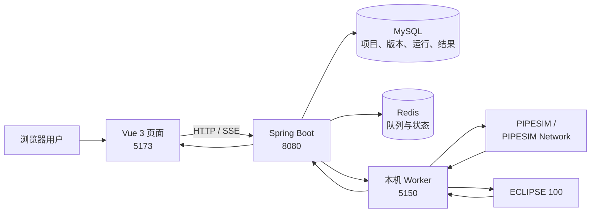
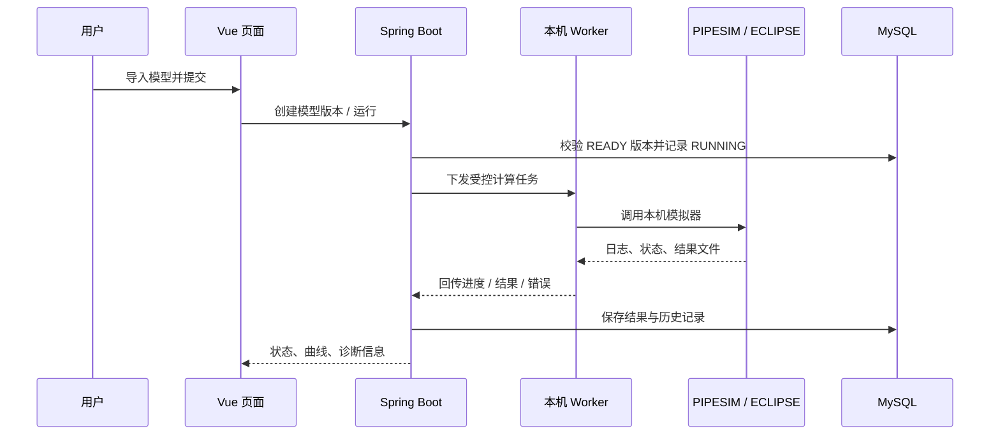

# GRDP Studio

<p align="center">
  
</p>

<h3 align="center">面向油气工程的可视化计算工作台</h3>

<p align="center">
  从模型导入、参数校验，到本机求解和结果展示，统一在浏览器中完成。
</p>

<p align="center">
  
  
  
  
</p>

> 当前仓库重点是 **PIPESIM Well、PIPESIM Network 和 ECLIPSE 100 的可展示计算链路**。模拟器、许可证、模型文件和业务数据属于本机环境，不随 Git 仓库分发。

## 先看懂：一次计算发生了什么



浏览器只访问 Spring Boot；Worker 只在本机回环地址监听并负责调用模拟器；Spring Boot 负责项目、模型版本、运行状态、事件和结果的持久化。这样既能把页面与求解器解耦，也能在没有模拟器时先启动页面进行演示。

### 计算链路时序



## 能力概览

<table>
  <tr>
    <td align="center"><br><b>PIPESIM</b><br>井模型与网络模型适配</td>
    <td align="center"><br><b>ECLIPSE 100</b><br>DATA 模型计算链路</td>
    <td align="center">📈<br><b>结果展示</b><br>状态、曲线与历史运行</td>
    <td align="center">🧩<br><b>工程化集成</b><br>版本、事件与产物管理</td>
  </tr>
</table>

| 运行模式 | 能看到什么 | 是否需要本机模拟器 |
| --- | --- | --- |
| 页面模式 | 登录、工作台、项目和页面布局 | 否 |
| 软件集成模式 | 模型导入、校验、Worker 状态和运行记录 | 执行真实计算时需要 |
| 完整计算模式 | 调用 PIPESIM/ECLIPSE 并展示真实结果 | 是，需要许可证 |

## 快速开始

### 1. 准备环境

- Windows 10/11、Git、Docker Desktop；
- JDK 21、Apache Maven 3.9.x、Node.js LTS、.NET 10 SDK；
- 需要真实计算时，再安装 PIPESIM 2022.1、Python Toolkit、ECLIPSE 2024.1 及相应许可证。

### 2. 克隆代码并进入项目

```powershell
git clone -b violet/feature/software-integration-ui https://github.com/JIMIOBM/GRDP-Studio.git
cd GRDP-Studio
```

### 3. 初始化本机配置

```powershell
Copy-Item backend/.env.example backend/.env
```

`backend/.env` 只用于本机，禁止提交。默认端口如下：

| 服务 | 端口 | 用途 |
| --- | ---: | --- |
| MySQL | 32000 | 项目、模型、运行和结果数据 |
| Redis | 6379 | 队列、缓存和状态 |
| Spring Boot | 8080 | 浏览器唯一访问的后端 API |
| Worker | 5150 | 本机模拟器适配与进程监督 |
| Vue/Vite | 5173 | 浏览器开发页面 |

真实计算机器还要检查 `worker/appsettings.json` 中的 `StorageRoot`、`PipesimHome`、`PipesimPtkPath`、`PythonPath` 和 `EclrunPath`。这些路径应使用本机配置，不能写入共享提交。

### 4. 安装前端依赖

```powershell
npm install
cd vue
npm install
npm run build
cd ..
```

### 5. 推荐启动方式

项目提供了聚合开发命令，页面演示不需要手动维护多个终端：Docker 在后台运行，`npm run dev` 会同时启动 Spring Boot 和 Vue。

**基础设施：MySQL 和 Redis**

```powershell
docker compose --env-file backend/.env -f backend/compose.yml up -d --wait
docker ps
```

应该看到 `grdp-mysql` 和 `grdp-redis`。Docker 数据卷会保留本机数据。

**页面模式：后端和前端**

确认 `JAVA_HOME` 指向 JDK 21，并确保后端运行参数与 `backend/.env` 一致，然后在项目根目录执行：

```powershell
npm run dev
```

该命令通过 `concurrently` 聚合启动 Spring Boot 和 Vue。浏览器访问：<http://127.0.0.1:5173/login>

后端健康检查：<http://127.0.0.1:8080/actuator/health>

<details>
<summary>后端无法连接本地数据库时</summary>

在启动聚合命令前，把 `backend/.env` 中的数据库和 Redis 参数配置到当前开发环境，或在 IDE 的运行配置中设置同名环境变量。示例开发值如下：

```text
MYSQL_URL=jdbc:mysql://127.0.0.1:32000/grdp_studio
MYSQL_USERNAME=grdp
MYSQL_PASSWORD=grdp_dev_password
REDIS_HOST=127.0.0.1
REDIS_PORT=6379
REDIS_PASSWORD=grdp_redis_password
SERVER_PORT=8080
```
</details>

**真实计算：按需启动 Worker**

只有执行 PIPESIM 或 ECLIPSE 任务时才需要 Worker。可以在 IDE 的任务配置中启动，也可以按需运行：

```powershell
dotnet run --project worker/Grdp.SoftwareIntegration.Worker.csproj
```

检查：<http://127.0.0.1:5150/api/health> 和 <http://127.0.0.1:5150/api/capabilities>

启动关系可以记成：

```text
Docker Desktop → MySQL/Redis → npm run dev（后端 + 前端）→ Worker（真实计算时）→ 模拟器
```

### 6. 停止服务

停止 `npm run dev` 和 Worker 后，在项目根目录运行：

```powershell
docker compose --env-file backend/.env -f backend/compose.yml down
```

该命令不会删除 Docker 数据卷。除非明确要清空本机数据库，否则不要使用 `down -v`。

## 目录导航

| 目录 | 负责内容 |
| --- | --- |
| `vue/` | Vue 页面、路由、API 调用和结果可视化 |
| `backend/` | Spring Boot API、持久化、运行编排和结果查询 |
| `worker/` | .NET Worker、进程监督、模拟器调用和结果归一化 |
| `backend/compose.yml` | 本地 MySQL/Redis 基础设施 |

## 常见检查

```powershell
# 检查端口是否被监听
Get-NetTCPConnection -LocalPort 32000,6379,8080,5150,5173 -State Listen

# 查看数据库表
docker exec grdp-mysql mysql -uroot -pgrdp_root_password -D grdp_studio -e "SHOW TABLES;"
```

网页、后端和 Worker 启动成功，不代表模拟器一定可用。真实计算还必须满足 Toolkit、Python、许可证、`eclrun.exe` 和模型文件均可访问；能力接口会区分代码、模型、许可证和安装环境问题。

## 验证命令

```powershell
# 前端
cd vue
npm run build
npm run test:e2e
cd ..

# Worker 与后端
dotnet build worker/Grdp.SoftwareIntegration.Worker.csproj
dotnet test worker/tests/Worker/Grdp.SoftwareIntegration.Worker.Tests.csproj
mvn -f backend/pom.xml test
```

构建通过只代表代码可以构建，不等于 PIPESIM/ECLIPSE 真实计算已经完成。真实计算应额外记录模型、版本、Run ID、结果和失败原因。

## 常见问题

<details>
<summary>没有安装 PIPESIM 或 ECLIPSE，能启动项目吗？</summary>

可以。先运行页面模式，网页和后端可以启动；执行对应模型时，能力状态会提示缺少模拟器、Toolkit、许可证或模型文件。
</details>

<details>
<summary>为什么浏览器不能直接访问 Worker？</summary>

这是架构约束。浏览器只访问 Spring Boot，Spring Boot 负责鉴权、校验、持久化和任务编排，再由本机 Worker 访问模拟器，避免把本地路径和可执行命令暴露给浏览器。
</details>

<details>
<summary>历史上的 start-grdp-ahks.bat 还能用吗？</summary>

它依赖仓库外的 AHKs、`.tools` 和原 GRDP 平台，不属于本仓库的标准启动方式。新环境应按本文档分别启动服务；只有已经配置好旧环境的开发机才适合继续使用该脚本。
</details>

<details>
<summary>数据库在哪里？需要导入 PVT.zip 吗？</summary>

本项目的集成数据库由 Docker MySQL 管理，默认数据卷为 `grdp_mysql_data`。PVT、压力、温度、液荷和其他业务数据属于另一套数据库，除非对应功能明确要求，否则不要直接导入整份备份。
</details>

## 开发约定

1. 每次开发前先确认当前分支和工作区：`git status --short --branch`。
2. 本机配置放在 `.env`、`appsettings*.json` 或用户目录中，不提交密码、许可证、绝对路径和真实业务数据。
3. 页面演示统一使用 `npm run dev`；只有真实计算时才额外启动 Worker。
4. 提交前至少运行受影响层的构建和测试；真实计算要区分“代码构建成功”和“模拟器计算成功”。
5. 不要用 `docker compose down -v`、删除数据卷或覆盖模型文件来排查普通启动问题。
